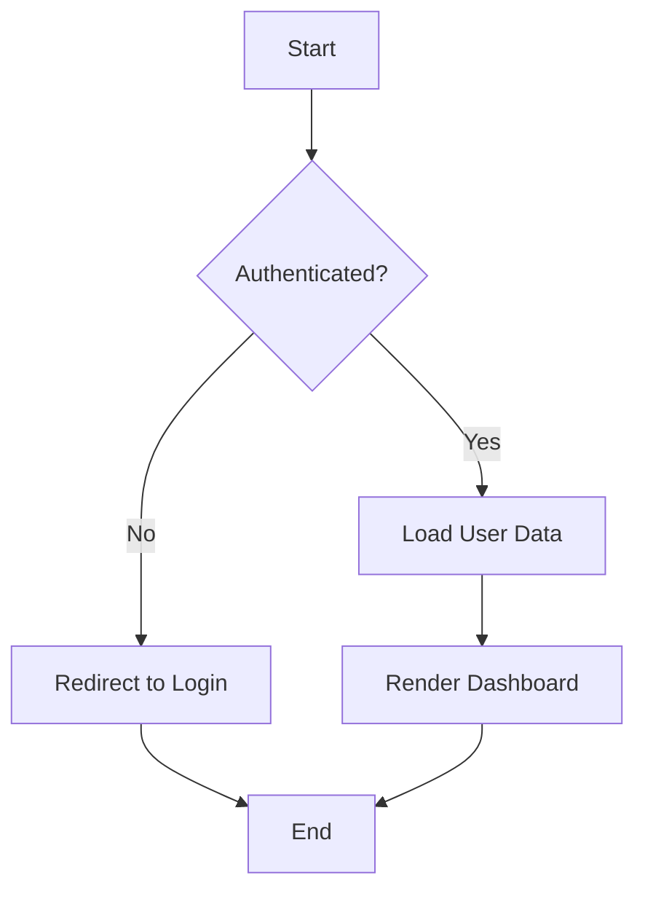
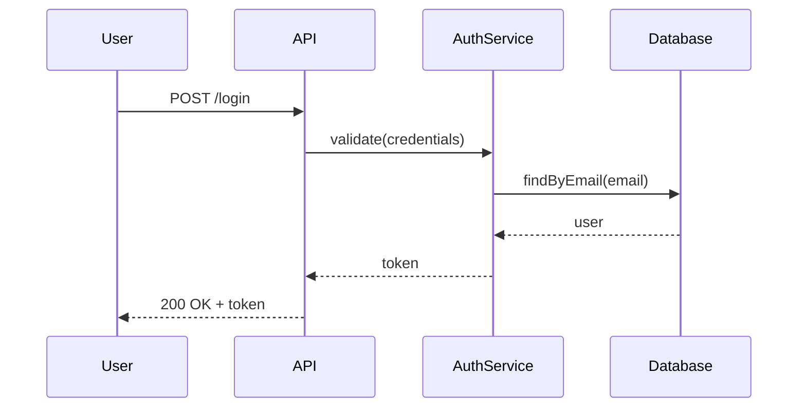

# Documentation Skill

Guidelines for writing clear, comprehensive, and maintainable documentation.

## What I Know

### Documentation Principles

1. **Document why**, not just what
2. **Keep it current** - outdated docs are worse than no docs
3. **Be concise** - respect the reader's time
4. **Use examples** - show, don't just tell
5. **Consider the audience** - beginners vs. experts
6. **Structure logically** - start simple, go deeper

### Code Documentation

**JSDoc (JavaScript/TypeScript)**
```ts
/**
 * Fetches a user by ID with their associated posts.
 *
 * @param id - The user ID to fetch
 * @param options - Optional configuration
 * @param options.includeDeleted - Whether to include soft-deleted posts
 * @returns The user with posts, or null if not found
 * @throws {NotFoundError} When the user doesn't exist
 *
 * @example
 * ```ts
 * const user = await getUserWithPosts(123, { includeDeleted: false })
 * console.log(user.posts.length)
 * ```
 */
async function getUserWithPosts(
  id: number,
  options: { includeDeleted?: boolean } = {}
): Promise<UserWithPosts | null> {
  // Implementation...
}
```

**PHPDoc (PHP/Laravel)**
```php
/**
 * Creates a new post with the provided data.
 *
 * @param array $data The post data including title, content, and author_id
 * @return Post The created post instance
 * @throws ValidationException When validation fails
 * @throws ConflictException When a post with same slug exists
 *
 * @example
 * ```php
 * $post = $postService->create([
 *     'title' => 'My First Post',
 *     'content' => 'This is the content...',
 *     'author_id' => 1,
 * ]);
 * ```
 */
public function create(array $data): Post;
```

**React Component Docs**
```tsx
/**
 * Button component with support for different variants and sizes.
 *
 * @example
 * ```tsx
 * <Button variant="primary" size="lg" onClick={handleClick}>
 *   Submit
 * </Button>
 * ```
 */
interface ButtonProps {
  /** Visual style of the button */
  variant?: 'primary' | 'secondary' | 'ghost'
  /** Size of the button */
  size?: 'sm' | 'md' | 'lg'
  /** Click handler */
  onClick?: () => void
  /** Button content */
  children: React.ReactNode
}
```

### README Structure

```markdown
# Project Name

Brief description (1-2 sentences).

## Quick Start

```bash
npm install
npm run dev
```

## Features

- Feature 1 - Description
- Feature 2 - Description
- Feature 3 - Description

## Installation

Prerequisites:
- Node.js 18+
- PHP 8.1+
- MySQL 8+

See [Installation Guide](docs/installation.md) for details.

## Usage

Basic usage example with code snippet.

## Configuration

Environment variables and configuration options.

## API Reference

Link to detailed API documentation.

## Contributing

See [Contributing Guide](CONTRIBUTING.md).

## License

MIT
```

### API Documentation

**Endpoint Documentation Format**
```markdown
### Create User

Creates a new user account.

**Request** `POST /api/users`

| Parameter | Type | Required | Description |
|-----------|------|----------|-------------|
| name | string | Yes | User's full name |
| email | string | Yes | Valid email address |
| password | string | Yes | Min 8 characters |

**Response** `201 Created`

```json
{
  "data": {
    "id": 1,
    "name": "John Doe",
    "email": "john@example.com",
    "created_at": "2024-01-15T10:30:00Z"
  }
}
```

**Error Response** `400 Bad Request`

```json
{
  "error": "Validation failed",
  "errors": {
    "email": ["The email has already been taken."]
  }
}
```
```

### Changelog Format

```markdown
# Changelog

## [Unreleased]

### Added
- New feature that was recently added

### Changed
- Modification to existing functionality

### Deprecated
- Feature that will be removed in future

### Removed
- Feature that was removed

### Fixed
- Bug fix

### Security
- Security vulnerability fix

## [1.2.0] - 2024-01-15

### Added
- User authentication
- Email notifications

### Fixed
- Fixed login redirect issue
```

### Writing Style Guidelines

**DO:**
- Use present tense ("creates a user" not "created a user")
- Use active voice ("The function validates" not "Validation is done by")
- Be specific ("returns a User object" not "returns the user")
- Include examples for complex functions
- Document edge cases and error conditions

**DON'T:**
- Document obvious code (`// Set count to 1`)
- Copy-paste the same comment everywhere
- Use vague terms ("processes the data")
- Over-document simple getters/setters
- Let docs drift from implementation

### Comment Guidelines

**When to Comment:**
- Explain WHY something is done (non-obvious reasons)
- Document complex algorithms
- Note workarounds or temporary solutions
- Reference external resources/specs
- Warn about potential pitfalls

**When NOT to Comment:**
- Obvious code (`i++ // increment i`)
- Redundant information (`return true // returns true`)
- Outdated information (delete/update or don't write)

### Diagrams

**Using Mermaid for Flowcharts**
```markdown

```

**Sequence Diagrams**
```markdown

```

### Examples Section

**Good Example Format**
````markdown
## Examples

### Basic Usage

```ts
import { UserService } from './services'

const service = new UserService()
const user = await service.findById(1)
```

### With Options

```ts
const users = await service.findAll({
  page: 2,
  limit: 50,
  include: ['posts', 'settings']
})
```

### Error Handling

```ts
try {
  await service.create(userData)
} catch (error) {
  if (error instanceof ValidationError) {
    // Handle validation errors
  }
}
```
````

---

*Part of SuperAI GitHub - Centralized OpenCode Configuration*
